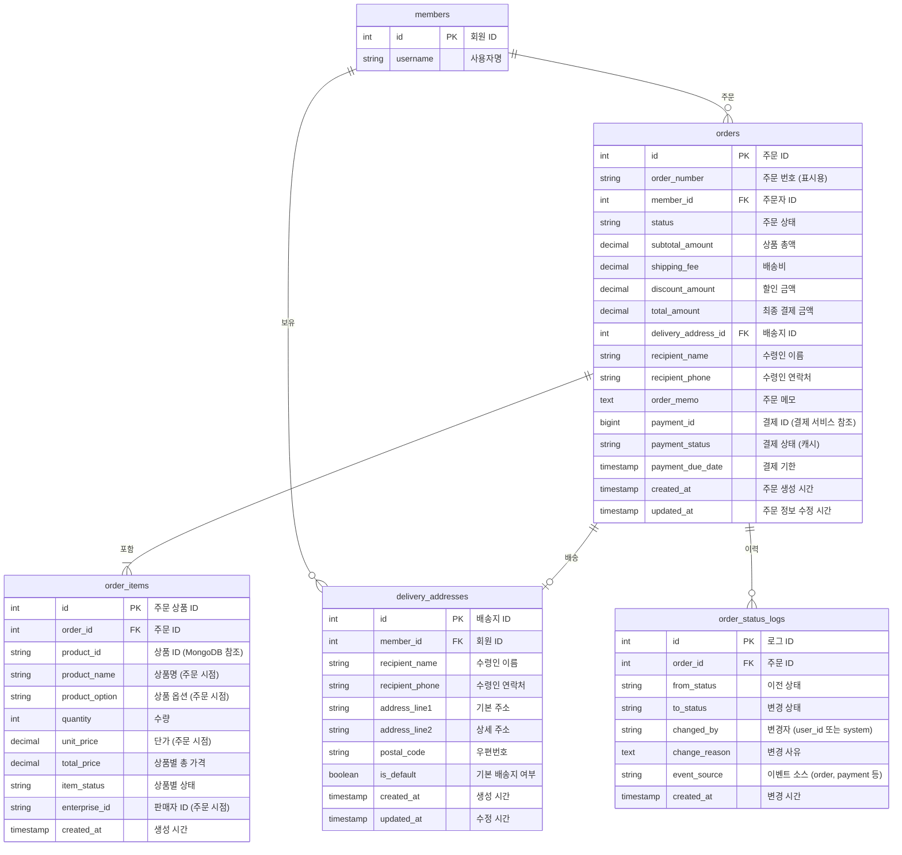
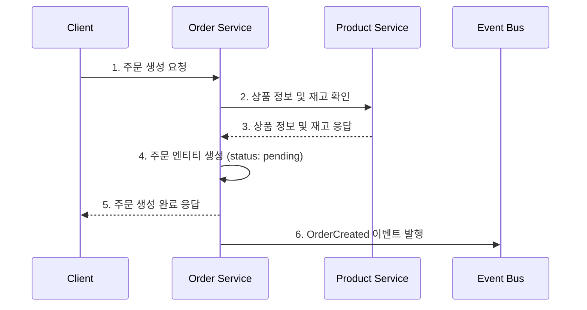

# 주문 서비스 (Order Service)

## 개요

주문 서비스는 이커머스 마켓플레이스에서 고객의 주문을 관리하는 독립적인 마이크로서비스입니다. 이 서비스는 주문 생성부터 배송 관리까지 주문 생명주기 전체를 담당합니다.

## 주요 책임

- 주문 생성 및 관리
- 주문 상태 트래킹
- 배송 정보 관리
- 주문 취소 및 변경 처리
- 주문 이력 관리

## 데이터 모델



## 주문 상태 흐름

```
pending → paid → preparing → shipping → delivered
        ↘ canceled
```

| 상태      | 설명                      |
| --------- | ------------------------- |
| pending   | 주문 생성됨, 결제 대기 중 |
| paid      | 결제 완료됨               |
| preparing | 상품 준비 중              |
| shipping  | 배송 중                   |
| delivered | 배송 완료                 |
| canceled  | 주문 취소됨               |

## 발행 이벤트

주문 서비스는 다음과 같은 도메인 이벤트를 발행합니다:

| 이벤트                     | 페이로드                                               | 설명                      |
| -------------------------- | ------------------------------------------------------ | ------------------------- |
| OrderCreated               | {orderId, orderNumber, memberId, totalAmount, items[]} | 주문이 생성되었을 때      |
| OrderStatusChanged         | {orderId, oldStatus, newStatus, reason}                | 주문 상태가 변경되었을 때 |
| OrderCancellationRequested | {orderId, reason}                                      | 주문 취소가 요청되었을 때 |
| OrderCanceled              | {orderId, reason}                                      | 주문이 취소되었을 때      |

## 구독 이벤트

주문 서비스는 다음과 같은 외부 이벤트를 구독합니다:

| 이벤트                | 소스        | 처리                                    |
| --------------------- | ----------- | --------------------------------------- |
| PaymentCompleted      | 결제 서비스 | 주문 상태를 'paid'로 업데이트           |
| PaymentFailed         | 결제 서비스 | 주문 상태를 'payment_failed'로 업데이트 |
| PaymentCanceled       | 결제 서비스 | 결제 취소 정보 업데이트                 |
| PaymentRefunded       | 결제 서비스 | 환불 정보 업데이트                      |
| ProductStockConfirmed | 상품 서비스 | 재고 확인 완료 처리                     |

## API 엔드포인트

```
# 주문 관리
POST /api/orders                # 주문 생성
GET /api/orders                 # 주문 목록 조회
GET /api/orders/{id}            # 주문 상세 조회
PUT /api/orders/{id}/cancel     # 주문 취소
PUT /api/orders/{id}/status     # 주문 상태 변경 (어드민용)

# 배송지 관리
GET /api/delivery-addresses     # 배송지 목록 조회
POST /api/delivery-addresses    # 배송지 추가
PUT /api/delivery-addresses/{id}# 배송지 수정
DELETE /api/delivery-addresses/{id} # 배송지 삭제
```

## 주문 생성 프로세스



## 기술 스택

- **언어/프레임워크**: Java 17, Spring Boot 3.x
- **데이터베이스**: PostgreSQL
- **메시지 브로커**: Apache Kafka
- **API 문서화**: Swagger/OpenAPI
- **테스트**: JUnit 5, TestContainers

## 의존성

- **외부 서비스 의존성**:

  - 상품 서비스: 상품 정보 및 재고 확인
  - 결제 서비스: 결제 상태 연동
  - 회원 서비스: 회원 정보 및 인증

- **인프라 의존성**:
  - PostgreSQL: 주문 데이터 저장
  - Kafka: 이벤트 발행 및 구독
  - Redis: 분산 락 (동시성 제어용)

## 성능 요구사항

- 초당 최대 주문 처리량: 100 TPS
- 주문 생성 API 응답 시간: 99퍼센타일 500ms 이하
- 가용성 목표: 99.9%

## 모니터링 지표

- 초당 주문 생성 수
- 주문 상태별 분포
- 취소율
- API 응답 시간
- 이벤트 처리 지연시간

## 확장 고려사항

1. **멀티 벤더 지원**:

   - 단일 주문에 여러 판매자 상품 포함 시 주문 분할 처리

2. **부분 배송/취소 처리**:

   - 주문 아이템 별 상태 관리 확장

3. **국제 배송 지원**:

   - 국가별 배송 정책 및 주소 체계 지원

4. **대용량 처리**:
   - 주문 데이터 아카이빙 및 샤딩 전략
