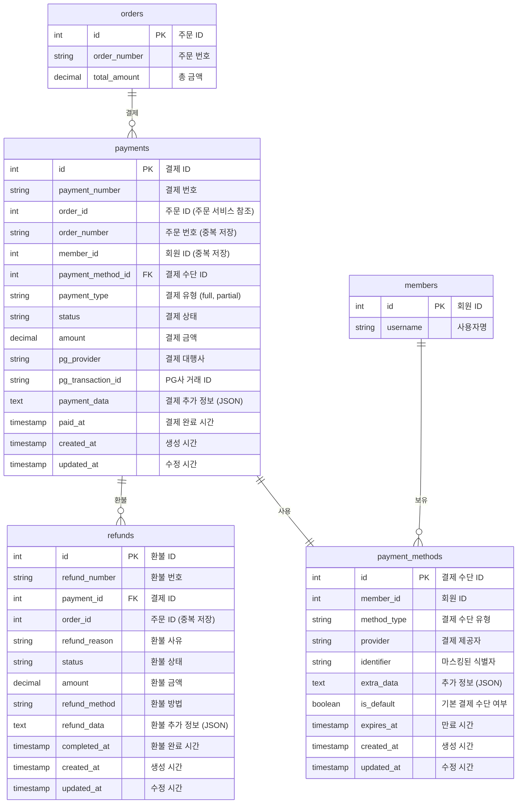
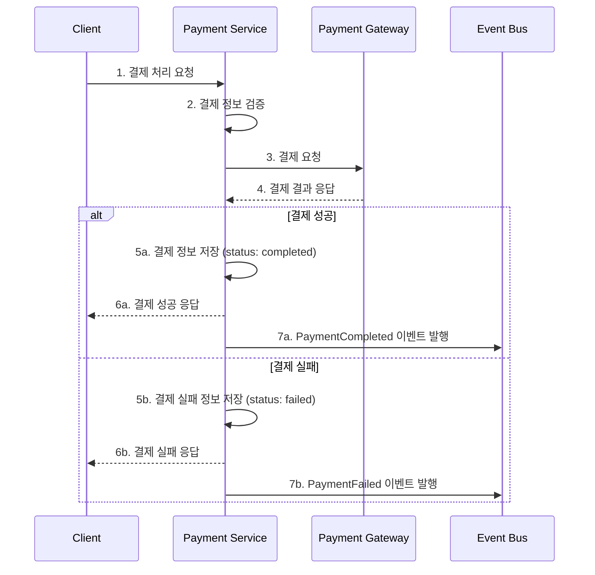

# 결제 서비스 (Payment Service)

## 개요

결제 서비스는 이커머스 마켓플레이스의 결제 처리를 담당하는 독립적인 마이크로서비스입니다. 다양한 결제 수단을 지원하고, PG사 연동 및 결제 생명주기 전체를 관리합니다.

## 주요 책임

- 결제 처리 및 관리
- 다양한 결제 수단 지원
- PG사 연동 및 관리
- 환불 처리
- 결제 정보 보안 관리

## 데이터 모델



## 결제 상태 흐름

```
created → pending → completed
        ↘ failed → canceled
```

| 상태      | 설명             |
| --------- | ---------------- |
| created   | 결제 정보 생성됨 |
| pending   | 결제 진행 중     |
| completed | 결제 완료됨      |
| failed    | 결제 실패함      |
| canceled  | 결제 취소됨      |

## 환불 상태 흐름

```
requested → processing → completed
          ↘ rejected
```

| 상태       | 설명         |
| ---------- | ------------ |
| requested  | 환불 요청됨  |
| processing | 환불 처리 중 |
| completed  | 환불 완료됨  |
| rejected   | 환불 거부됨  |

## 지원 결제 수단

| 유형            | 설명        |
| --------------- | ----------- |
| credit_card     | 신용카드    |
| bank_transfer   | 계좌이체    |
| virtual_account | 가상계좌    |
| mobile_payment  | 모바일 결제 |
| point           | 포인트 결제 |

## 발행 이벤트

결제 서비스는 다음과 같은 도메인 이벤트를 발행합니다:

| 이벤트           | 페이로드                               | 설명                 |
| ---------------- | -------------------------------------- | -------------------- |
| PaymentCreated   | {paymentId, orderId, amount, method}   | 결제가 생성되었을 때 |
| PaymentCompleted | {paymentId, orderId, pgTransactionId}  | 결제가 완료되었을 때 |
| PaymentFailed    | {paymentId, orderId, reason}           | 결제가 실패했을 때   |
| PaymentCanceled  | {paymentId, orderId}                   | 결제가 취소되었을 때 |
| RefundInitiated  | {refundId, paymentId, orderId, amount} | 환불이 시작되었을 때 |
| RefundCompleted  | {refundId, paymentId, orderId, amount} | 환불이 완료되었을 때 |

## 구독 이벤트

결제 서비스는 다음과 같은 외부 이벤트를 구독합니다:

| 이벤트                     | 소스        | 처리                     |
| -------------------------- | ----------- | ------------------------ |
| OrderCreated               | 주문 서비스 | 결제 정보 준비           |
| OrderCancellationRequested | 주문 서비스 | 결제 취소 또는 환불 처리 |

## API 엔드포인트

```
# 결제 처리
POST /api/payments                  # 결제 처리 요청
GET /api/payments/{id}              # 결제 정보 조회
GET /api/orders/{orderId}/payments  # 주문별 결제 내역 조회

# 환불 처리
POST /api/payments/{id}/refund      # 환불 요청
GET /api/refunds/{id}               # 환불 정보 조회
GET /api/payments/{id}/refunds      # 결제별 환불 내역 조회

# 결제 수단 관리
GET /api/payment-methods            # 결제 수단 목록 조회
POST /api/payment-methods           # 결제 수단 등록
DELETE /api/payment-methods/{id}    # 결제 수단 삭제
PUT /api/payment-methods/{id}/default # 기본 결제 수단 설정
```

## 결제 처리 프로세스



## PG사 통합

결제 서비스는 다음 PG사와 통합됩니다:

- 토스페이먼츠
- KG이니시스
- 나이스페이
- 페이팔 (글로벌 결제)

각 PG사별로 어댑터 패턴을 사용하여 통합합니다:

```java
public interface PaymentGateway {
    PaymentResult process(PaymentRequest request);
    RefundResult refund(RefundRequest request);
    PaymentStatus checkStatus(String transactionId);
}

public class TossPaymentsAdapter implements PaymentGateway {
    // 토스페이먼츠 구현
}

public class KgInicisAdapter implements PaymentGateway {
    // KG이니시스 구현
}
```

## 보안 요구사항

- 카드 정보는 PCI DSS 준수하여 처리
- 결제 정보 암호화 저장
- 결제 API는 TLS 1.3 강제
- 중요 결제 정보는 마스킹 처리하여 로깅
- 결제 데이터 접근에 대한 감사 로깅

## 기술 스택

- **언어/프레임워크**: Java 17, Spring Boot 3.x
- **데이터베이스**: PostgreSQL
- **메시지 브로커**: Apache Kafka
- **캐싱**: Redis
- **API 문서화**: Swagger/OpenAPI
- **테스트**: JUnit 5, Mockito, TestContainers

## 의존성

- **외부 서비스 의존성**:

  - PG사 API: 결제 처리를 위한 외부 API
  - 주문 서비스: 주문 정보 참조
  - 회원 서비스: 회원 정보 및 인증

- **인프라 의존성**:
  - PostgreSQL: 결제 데이터 저장
  - Kafka: 이벤트 발행 및 구독
  - Redis: 분산 락 및 멱등성 보장용 캐싱

## 성능 요구사항

- 초당 최대 결제 처리량: 200 TPS
- 결제 API 응답 시간: 99퍼센타일 800ms 이하
- 가용성 목표: 99.99%

## 모니터링 지표

- 초당 결제 처리 수
- 결제 성공/실패 비율
- PG사별 성능 및 가용성
- 결제 수단별 사용 비율
- API 응답 시간
- 결제 프로세스별 처리 시간

## 결제 관련 운영 이슈 대응

- **거래 불일치 처리**:

  - 결제 이중 처리 방지를 위한 멱등성 키 사용
  - 일별 결제-PG사 대사 배치 작업 구현

- **장애 복구**:
  - PG사 장애 시 자동 대체 PG사 라우팅
  - 결제 실패 시 자동 재시도 전략

## 확장 고려사항

1. **결제 예약 기능**:

   - 주기적 결제 및 구독 결제 지원

2. **다국어/다통화 지원**:

   - 여러 국가 및 통화 지원을 위한 확장

3. **분할 결제**:

   - 여러 결제 수단을 사용한 부분 결제 지원

4. **대용량 처리**:
   - 결제 데이터 아카이빙 및 샤딩 전략
