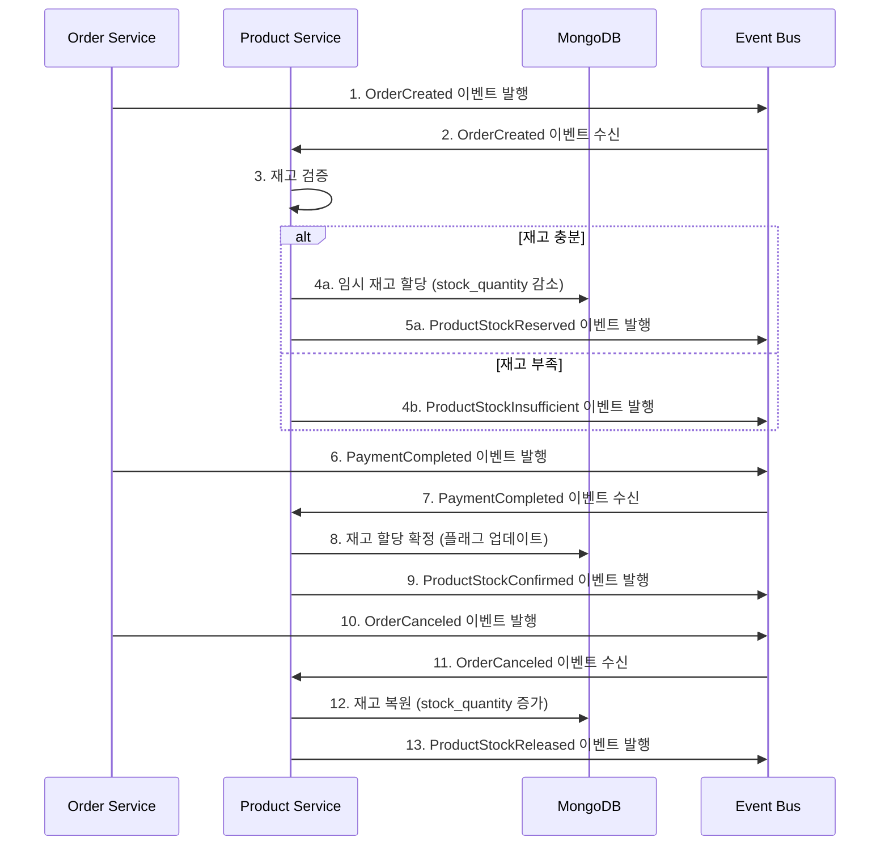

# 상품 서비스 (Product Service)

## 개요

상품 서비스는 이커머스 마켓플레이스의 상품 카탈로그 관리를 담당하는 독립적인 마이크로서비스입니다. MongoDB를 활용하여 다양한 상품 속성과 카테고리를 유연하게 관리하고, 재고와 가격 정보를 실시간으로 처리합니다.

## 주요 책임

- 상품 정보 관리 (등록, 수정, 삭제)
- 카테고리 관리
- 상품 검색 및 필터링
- 상품 재고 관리
- 상품 통계 관리 (조회수, 리뷰, 판매량)
- 위시리스트 관리

## 데이터 모델

```mermaid
erDiagram
    %% MongoDB 상품 시스템 (Product System)
    products ||--o{ product_reviews : "리뷰 보유"
    products ||--o{ product_stats : "통계 정보"
    products }o--o{ categories : "분류"
    enterprises ||--o{ products : "판매"
    members ||--o{ product_reviews : "작성"
    members ||--o{ wishlists : "보유"

    %% 외부 시스템 참조 (간소화)
    enterprises {
        int id PK "기업 ID (외부 시스템)"
        string business_name "회사/상점 이름"
    }

    members {
        int id PK "회원 ID (외부 시스템)"
        string username "사용자명"
    }

    %% 상품 카테고리
    categories {
        ObjectId _id "카테고리 ID"
        string name "카테고리명"
        string slug "URL용 슬러그"
        ObjectId parent_id "상위 카테고리 ID (null이면 최상위)"
        string description "카테고리 설명"
        number level "계층 레벨 (1=최상위)"
        number order_index "표시 순서"
        boolean is_active "활성화 여부"
        date created_at "생성 시간"
        date updated_at "수정 시간"
    }

    %% 상품 정보
    products {
        ObjectId _id "상품 ID"
        string enterprise_id "판매자 ID (외부 RDB 참조)"
        string name "상품명"
        string description "상품 설명"
        number price "판매 가격"
        number discount_price "할인가 (null이면 할인 없음)"
        array category_ids "카테고리 ID 배열"
        object attributes "상품 속성 (JSON)"
        array images "이미지 URL 배열"
        string status "상품 상태 (active, draft, sold_out 등)"
        number stock_quantity "재고 수량"
        boolean is_featured "추천 상품 여부"
        date created_at "생성 시간"
        date updated_at "수정 시간"
    }

    %% 상품 통계 (동시성 문제 해결용 분리)
    product_stats {
        ObjectId _id "통계 ID"
        ObjectId product_id "상품 ID"
        number review_count "리뷰 수"
        number total_rating_sum "별점 총합"
        number avg_rating "평균 평점 (1-5)"
        number view_count "조회수"
        number order_count "주문 수"
        date last_calculated "최종 계산 시간"
        date last_updated "최종 업데이트 시간"
    }

    %% 상품 리뷰
    product_reviews {
        ObjectId _id "리뷰 ID"
        ObjectId product_id "상품 ID"
        string member_id "회원 ID (외부 RDB 참조)"
        number rating "평점 (1-5)"
        string comment "리뷰 내용"
        array images "리뷰 이미지 URL 배열"
        boolean verified_purchase "구매 확인"
        date created_at "작성 시간"
        date updated_at "수정 시간"
    }

    %% 위시리스트
    wishlists {
        ObjectId _id "위시리스트 ID"
        string member_id "회원 ID (외부 RDB 참조)"
        array product_ids "상품 ID 배열"
        date created_at "생성 시간"
        date updated_at "수정 시간"
    }
```



## MongoDB 선택 이유

1. **유연한 스키마**:

   - 상품마다 속성(attributes)이 매우 다양하고 가변적임
   - 의류는 사이즈/색상/재질, 전자제품은 사양/기능/호환성 등 다른 속성 필요

2. **계층적 데이터 구조**:

   - 카테고리, 상품 속성, 이미지 등 복잡한 중첩 구조 자연스럽게 표현

3. **조회 성능 최적화**:

   - 상품 조회가 가장 빈번한 작업이며, 조회 패턴에 최적화 가능
   - 다양한 필터링과 정렬에 효율적인 인덱싱 전략 적용

4. **확장성**:
   - 대량의 상품 데이터 처리에 수평적 확장 용이

## 상품 상태

| 상태     | 설명                    |
| -------- | ----------------------- |
| draft    | 작성 중인 상품 (미공개) |
| active   | 판매 중인 상품          |
| inactive | 일시 판매 중단된 상품   |
| sold_out | 재고 소진된 상품        |
| deleted  | 삭제된 상품             |

## 발행 이벤트

상품 서비스는 다음과 같은 도메인 이벤트를 발행합니다:

| 이벤트                  | 페이로드                               | 설명                            |
| ----------------------- | -------------------------------------- | ------------------------------- |
| ProductCreated          | {productId, enterpriseId, name, price} | 상품이 생성되었을 때            |
| ProductUpdated          | {productId, updatedFields[]}           | 상품 정보가 업데이트되었을 때   |
| ProductStatusChanged    | {productId, oldStatus, newStatus}      | 상품 상태가 변경되었을 때       |
| ProductPriceChanged     | {productId, oldPrice, newPrice}        | 상품 가격이 변경되었을 때       |
| ProductStockChanged     | {productId, oldQuantity, newQuantity}  | 상품 재고가 변경되었을 때       |
| ProductCategoryAssigned | {productId, categoryId}                | 상품이 카테고리에 할당되었을 때 |
| CategoryCreated         | {categoryId, name, parentId}           | 카테고리가 생성되었을 때        |

## 구독 이벤트

상품 서비스는 다음과 같은 외부 이벤트를 구독합니다:

| 이벤트           | 소스        | 처리                                 |
| ---------------- | ----------- | ------------------------------------ |
| OrderCreated     | 주문 서비스 | 임시 재고 할당                       |
| OrderCanceled    | 주문 서비스 | 할당된 재고 복원                     |
| PaymentCompleted | 결제 서비스 | 재고 확정 차감 및 판매 통계 업데이트 |
| ReviewCreated    | 리뷰 서비스 | 상품 리뷰 통계 업데이트              |

## API 엔드포인트

```
# 상품 관리
POST /api/products                   # 상품 등록
GET /api/products                    # 상품 목록 조회
GET /api/products/{id}               # 상품 상세 조회
PUT /api/products/{id}               # 상품 정보 수정
PATCH /api/products/{id}/status      # 상품 상태 변경
PUT /api/products/{id}/stock         # 재고 수정

# 카테고리 관리
GET /api/categories                  # 카테고리 목록 조회
GET /api/categories/{id}             # 카테고리 상세 조회
POST /api/categories                 # 카테고리 생성
PUT /api/categories/{id}             # 카테고리 수정
GET /api/categories/{id}/products    # 카테고리별 상품 조회

# 리뷰 관리
GET /api/products/{id}/reviews       # 상품 리뷰 조회
POST /api/products/{id}/reviews      # 상품 리뷰 작성
PUT /api/reviews/{id}                # 리뷰 수정
DELETE /api/reviews/{id}             # 리뷰 삭제

# 위시리스트 관리
GET /api/members/{id}/wishlist       # 위시리스트 조회
POST /api/members/{id}/wishlist      # 위시리스트에 상품 추가
DELETE /api/members/{id}/wishlist/{productId} # 위시리스트에서 상품 제거

# 검색 및 필터링
GET /api/products/search             # 상품 검색
GET /api/products/filter             # 조건별 필터링
```

## 검색 및 필터링 기능

상품 검색 및 필터링 API는 다음과 같은 파라미터를 지원합니다:

- `q`: 검색어 (상품명, 설명)
- `category`: 카테고리 ID
- `min_price`, `max_price`: 가격 범위
- `brand`: 브랜드 필터
- `attributes.*`: 동적 속성 필터 (attributes.color=red 등)
- `sort`: 정렬 기준 (price_asc, price_desc, newest, popular)
- `page`, `size`: 페이지네이션

## 인덱스 전략

MongoDB 컬렉션의 효율적인 쿼리를 위한 인덱스:

```javascript
// 상품 인덱스
db.products.createIndex({ name: "text", description: "text" }); // 텍스트 검색
db.products.createIndex({ enterprise_id: 1 }); // 판매자별 조회
db.products.createIndex({ category_ids: 1 }); // 카테고리별 조회
db.products.createIndex({ price: 1 }); // 가격 기준 정렬/필터링
db.products.createIndex({ status: 1, created_at: -1 }); // 상태 및 최신순 정렬

// 카테고리 인덱스
db.categories.createIndex({ parent_id: 1 }); // 계층 구조 쿼리
db.categories.createIndex({ slug: 1 }, { unique: true }); // URL 조회

// 리뷰 인덱스
db.product_reviews.createIndex({ product_id: 1 }); // 상품별 리뷰 조회
db.product_reviews.createIndex({ member_id: 1 }); // 회원별 리뷰 조회

// 통계 인덱스
db.product_stats.createIndex({ product_id: 1 }, { unique: true }); // 상품 통계 조회
```

## 재고 관리 프로세스



## 통계 데이터 일관성

동시성 문제를 해결하기 위해 상품 통계(`product_stats`)를 별도 컬렉션으로 분리하고 다음 전략을 사용합니다:

1. **원자적 업데이트 연산**:

   - 카운터 증가를 위해 `$inc` 연산자 활용
   - 총합 계산을 위해 `$set` 연산자 사용

2. **주기적 데이터 재계산**:

   - 스케줄러를 통한 정기적인 통계 데이터 검증 및 갱신
   - 방식: 집계 파이프라인으로 실제 데이터 계산 → 저장된 통계와 비교 → 불일치 시 수정

3. **이벤트 기반 비동기 업데이트**:
   - 리뷰 추가/수정 이벤트 발생 시 비동기적으로 통계 업데이트
   - 성능과 일관성의 균형 유지

## 기술 스택

- **언어/프레임워크**: Java 17, Spring Boot 3.x
- **데이터베이스**: MongoDB 6.x
- **검색 엔진**: MongoDB Atlas Search 또는 Elasticsearch
- **캐싱**: Redis (Hot 상품 및 카테고리 캐싱)
- **메시지 브로커**: Apache Kafka
- **스토리지**: AWS S3 (상품 이미지 저장)
- **CDN**: AWS CloudFront (이미지 전송 최적화)
- **API 문서화**: Swagger/OpenAPI
- **테스트**: JUnit 5, Mockito, TestContainers

## 의존성

- **인프라 의존성**:

  - MongoDB: 상품 및 카테고리 데이터 저장
  - Redis: 캐싱 및 조회수 카운터
  - Kafka: 이벤트 발행 및 구독
  - S3: 이미지 스토리지

- **외부 서비스 의존성**:
  - 판매자 서비스: 판매자 정보 및 권한 확인
  - 주문 서비스: 재고 처리 연동
  - 검색 서비스: 고급 검색 기능 (선택적)

## 성능 요구사항

- 상품 상세 조회 API 응답 시간: 99퍼센타일 100ms 이하
- 상품 검색 및 필터링 API 응답 시간: 99퍼센타일 300ms 이하
- 최대 동시 접속자 처리: 10,000 CCU
- 가용성 목표: 99.95%

## 모니터링 지표

- 상품 조회 횟수 (상품별, 카테고리별)
- API 응답 시간
- 검색 쿼리 성능
- 캐시 히트율
- MongoDB 쿼리 성능
- 재고 변경 이벤트 처리 시간

## 이미지 처리 전략

1. **이미지 업로드 프로세스**:

   - 판매자가 S3 Pre-signed URL을 통해 직접 S3에 업로드
   - 업로드 완료 후 이미지 URL을 상품 정보에 저장

2. **이미지 최적화**:

   - 원본 이미지 보존
   - 다양한 크기의 썸네일 자동 생성 (Lambda 함수 활용)
   - WebP 포맷 변환으로 용량 최적화

3. **CDN 활용**:
   - 전 세계 사용자를 위한 이미지 전송 최적화
   - 캐싱 정책으로 부하 감소

## 확장 고려사항

1. **고급 검색 기능**:

   - Elasticsearch 또는 MongoDB Atlas Search를 활용한 풀텍스트 검색
   - 자동 완성 및 추천 검색어 기능

2. **개인화된 추천**:

   - 사용자 행동 기반 추천 알고리즘 통합
   - 협업 필터링 및 콘텐츠 기반 필터링 구현

3. **국제화 지원**:

   - 다국어 상품 정보 및 카테고리 지원
   - 국가별 가격 및 재고 관리

4. **대규모 확장**:
   - MongoDB 샤딩을 통한 수평적 확장
   - 읽기 부하 분산을 위한 복제본 활용
   - 지역별 데이터 분산 저장
