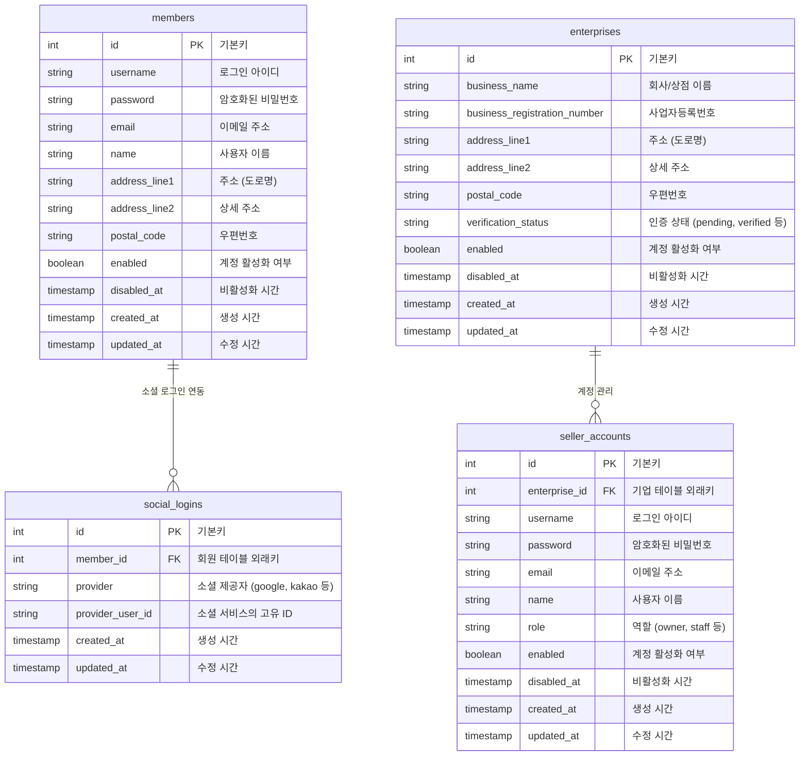
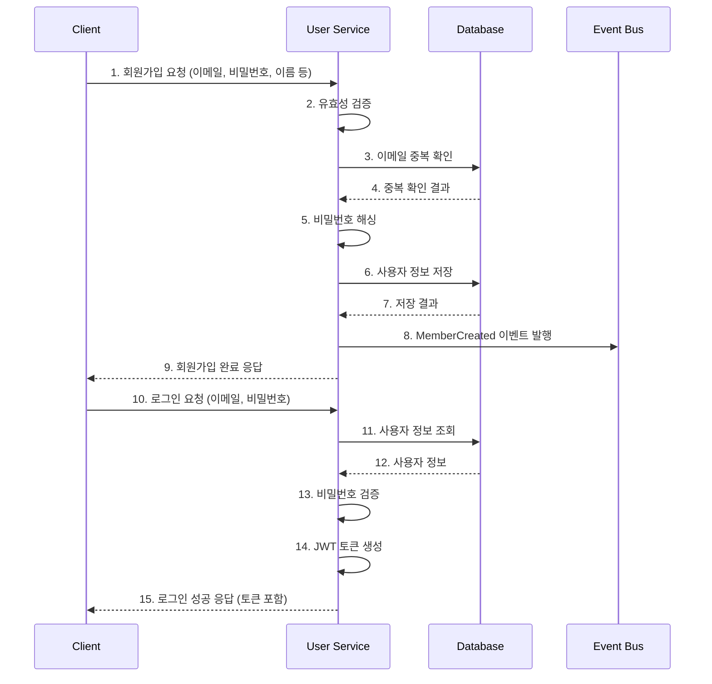
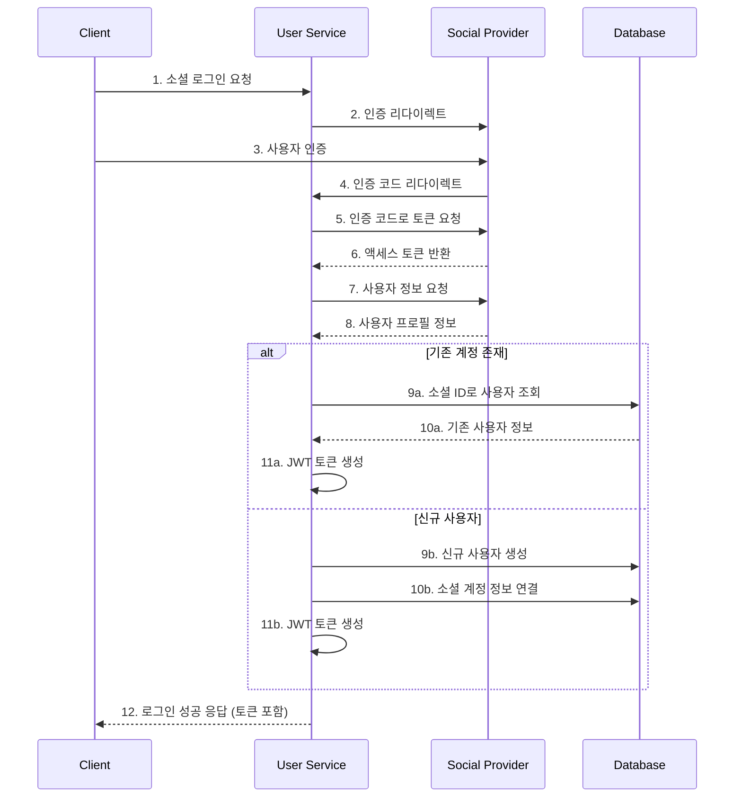

# 사용자 서비스 (User Service)

## 개요

사용자 서비스는 이커머스 마켓플레이스의 회원 관리와 인증을 담당하는 독립적인 마이크로서비스입니다. 일반 구매자(Members)와 판매자(Enterprises & Seller Accounts)의 계정 관리를 모두 처리합니다.

## 주요 책임

- 구매자 회원 가입 및 관리
- 판매자 회원 가입 및 관리
- 인증 및 권한 관리
- 프로필 정보 관리
- 소셜 로그인 연동

## 데이터 모델



## 사용자 유형 및 역할

### 구매자 (Members)

- 일반 구매자: 상품 구매 및 리뷰 작성 가능
- 프리미엄 구매자: 추가 혜택 및 서비스 이용 가능

### 판매자 (Seller Accounts)

- 소유자(owner): 판매자 계정 관리 및 모든 권한 보유
- 스태프(staff): 상품 관리 및 주문 처리 권한

### 관리자 (Admin)

- 시스템 관리자: 플랫폼 전체 관리
- 고객 지원: 고객 문의 및 분쟁 해결 담당

## 인증 및 인가

### 인증 방식

- 기본 인증: 사용자명/비밀번호
- 소셜 로그인: Google, Kakao, Naver 등
- OAuth 2.0 + JWT 토큰 기반 인증

### 인가 전략

- RBAC(Role Based Access Control): 역할 기반 권한 관리
- API별 접근 권한 설정
- 세분화된 리소스 접근 제어

## 발행 이벤트

사용자 서비스는 다음과 같은 도메인 이벤트를 발행합니다:

| 이벤트               | 페이로드                         | 설명                            |
| -------------------- | -------------------------------- | ------------------------------- |
| MemberCreated        | {memberId, email, name}          | 새 구매자 회원이 생성되었을 때  |
| MemberUpdated        | {memberId, updatedFields[]}      | 구매자 정보가 업데이트되었을 때 |
| MemberDisabled       | {memberId, reason}               | 구매자 계정이 비활성화되었을 때 |
| EnterpriseCreated    | {enterpriseId, businessName}     | 새 판매자 기업이 생성되었을 때  |
| EnterpriseVerified   | {enterpriseId, verificationDate} | 판매자 기업이 인증되었을 때     |
| SellerAccountCreated | {sellerId, enterpriseId, role}   | 새 판매자 계정이 생성되었을 때  |

## 구독 이벤트

사용자 서비스는 다음과 같은 외부 이벤트를 구독합니다:

| 이벤트           | 소스        | 처리                           |
| ---------------- | ----------- | ------------------------------ |
| OrderCompleted   | 주문 서비스 | 구매자 구매 이력 업데이트      |
| ProductPurchased | 상품 서비스 | 구매자 구매 상품 통계 업데이트 |
| ReviewCreated    | 리뷰 서비스 | 구매자 활동 이력 업데이트      |

## API 엔드포인트

```
# 구매자 회원 관리
POST /api/members                    # 구매자 회원가입
POST /api/members/login              # 구매자 로그인
GET /api/members/me                  # 내 정보 조회
PUT /api/members/me                  # 내 정보 수정
PUT /api/members/me/password         # 비밀번호 변경
GET /api/members/me/orders           # 내 주문 조회

# 소셜 로그인
GET /api/auth/social/{provider}      # 소셜 로그인 시작
GET /api/auth/social/{provider}/callback # 소셜 로그인 콜백
GET /api/members/me/social-logins    # 연결된 소셜 계정 조회
POST /api/members/me/social-logins   # 소셜 계정 연결
DELETE /api/members/me/social-logins/{id} # 소셜 계정 연결 해제

# 판매자 기업 관리
POST /api/enterprises                # 판매자 기업 등록
GET /api/enterprises/{id}            # 기업 정보 조회
PUT /api/enterprises/{id}            # 기업 정보 수정
POST /api/enterprises/{id}/verify    # 기업 인증 요청

# 판매자 계정 관리
POST /api/enterprises/{id}/seller-accounts # 판매자 계정 생성
GET /api/enterprises/{id}/seller-accounts  # 판매자 계정 목록 조회
PUT /api/seller-accounts/{id}        # 판매자 계정 수정
PUT /api/seller-accounts/{id}/role   # 판매자 역할 변경
```

## 회원가입 및 인증 프로세스



## 소셜 로그인 프로세스



## 기술 스택

- **언어/프레임워크**: Java 17, Spring Boot 3.x
- **보안**: Spring Security, JWT
- **데이터베이스**: PostgreSQL
- **캐싱**: Redis (세션 및 토큰 관리)
- **메시징**: Apache Kafka
- **API 문서화**: Swagger/OpenAPI
- **테스트**: JUnit 5, Mockito, TestContainers

## 의존성

- **인프라 의존성**:

  - PostgreSQL: 사용자 데이터 저장
  - Redis: 토큰 및 세션 관리
  - Kafka: 이벤트 발행 및 구독

- **외부 서비스 의존성**:
  - 소셜 로그인 제공자 API: Google, Kakao, Naver 등
  - 이메일 서비스: 인증 및 알림 이메일 발송

## 보안 요구사항

- 비밀번호 해싱: BCrypt 알고리즘 사용
- 민감한 정보 암호화 저장
- API 접근에 대한 인증 및 인가 적용
- JWT 토큰 최소 권한 원칙 적용
- 로그인 시도 제한으로 무차별 대입 공격 방지
- HTTPS 강제 적용
- OWASP Top 10 취약점 대응

## 성능 요구사항

- 초당 최대 로그인 처리량: 500 TPS
- 사용자 정보 조회 API 응답 시간: 99퍼센타일 100ms 이하
- 동시 최대 활성 세션 수: 100,000
- 가용성 목표: 99.9%

## 모니터링 지표

- 로그인 성공/실패 비율
- 소셜 로그인 비율
- 회원가입 전환율
- 활성 사용자 수
- API 응답 시간
- 토큰 검증 시간

## 확장 고려사항

1. **멀티테넌시 지원**:

   - 여러 마켓플레이스 인스턴스를 단일 사용자 서비스로 지원

2. **2단계 인증**:

   - OTP 또는 SMS를 통한 2단계 인증 추가

3. **고급 인가 모델**:

   - ABAC(Attribute Based Access Control) 도입

4. **계정 통합**:

   - 구매자와 판매자 계정 통합 관리 옵션

5. **대규모 확장**:
   - 글로벌 사용자 지원을 위한 지역별 분산 배포
